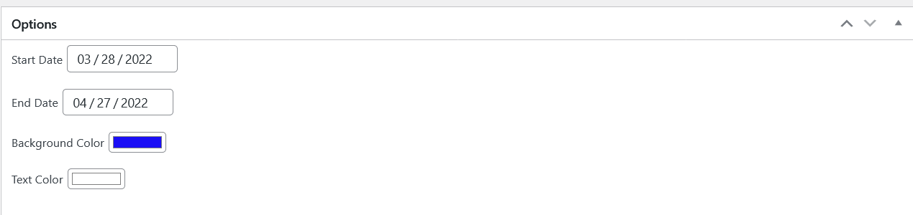
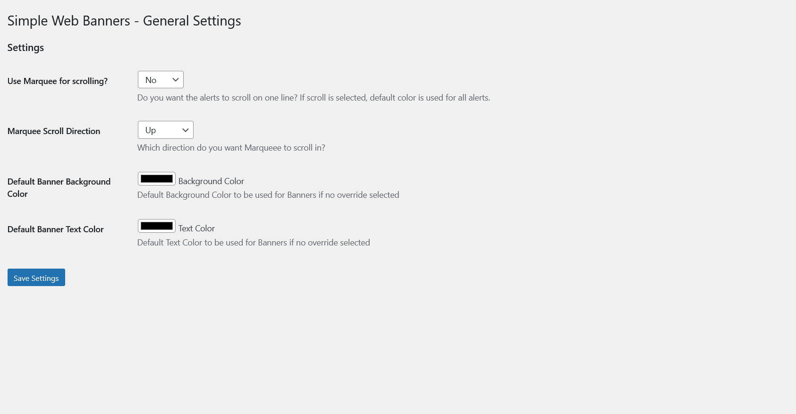

# Simple-WP-Web-Banners

A simple Wordpress plugin to make site-wide banners for your website.

Super simple plugin to allow you to create site wide banners/alerts on the top of all of your pages.

Banners can be setup to stack on top of each other or scroll using a marquee.

## Screenshots

Sample Banner

Options for Banners

Global Options

##Install
- 1. Download the Github to a ZIP File or download from the releases.
- 2. Extract ZIP and upload to /wp-content/plugins folder or upload via the WP Admin
- 3. Activate plugin
- 4. Global Options can be found in Settings -> Web Banners Options new Banners can be created with the Web Banners menu item.
